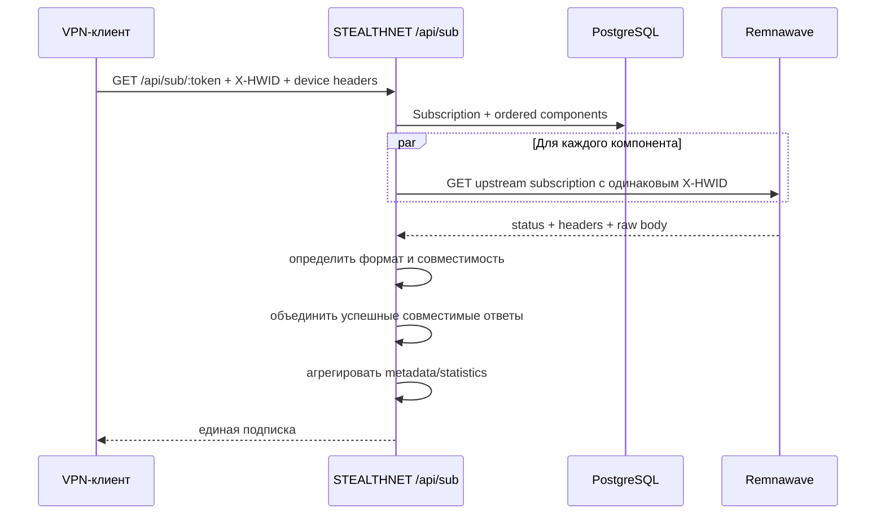
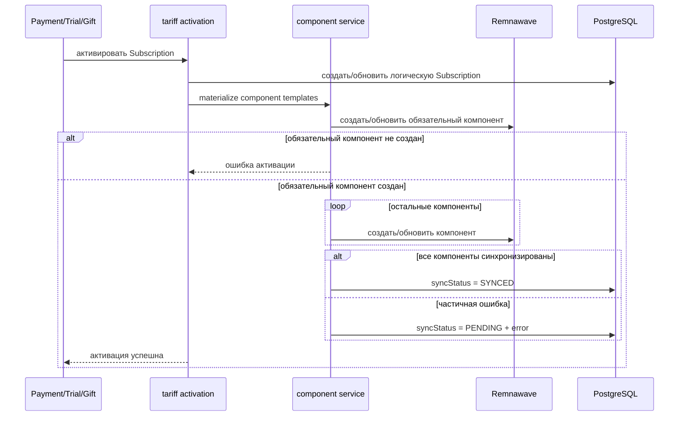
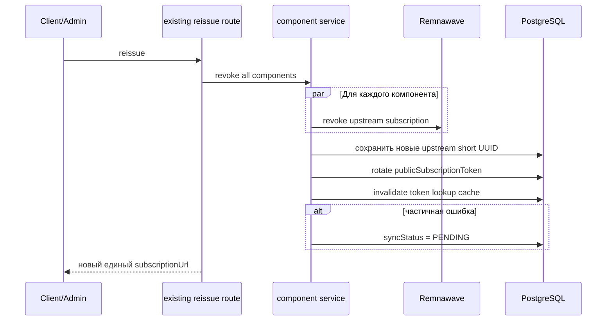
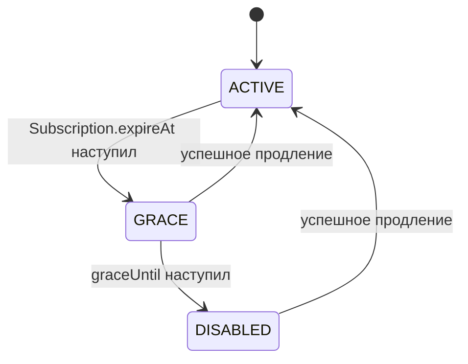
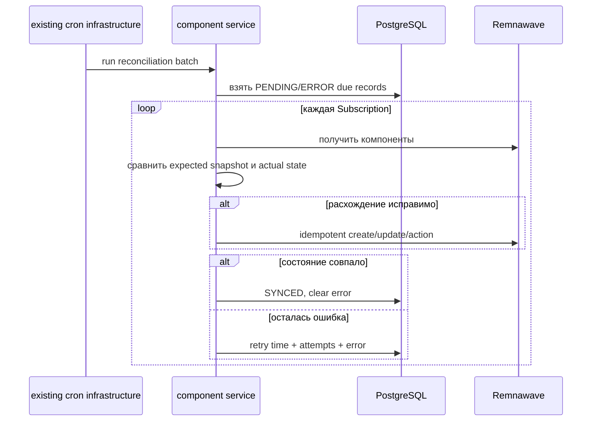
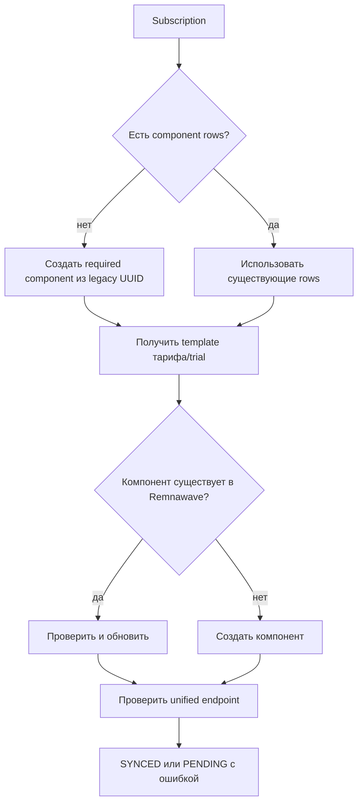

# Архитектура составных подписок Remnawave

Статус: реализовано в ветке `feature/composite-subscriptions`
Проект: STEALTHNET  
Дата: 2026-07-14

## 1. Цель

Одна логическая подписка STEALTHNET должна управлять произвольным количеством
пользователей Remnawave и выдавать пользователю одну ссылку подключения.

WhiteList является первым дополнительным компонентом, но архитектура не должна
содержать бизнес-правил, привязанных к WhiteList. Те же механизмы должны без
рефакторинга поддерживать будущие компоненты, например Telegram, Streaming,
Gaming или Corporate.

Существующие возможности STEALTHNET сохраняются:

- несколько логических подписок у одного клиента;
- подарки;
- trial;
- дополнительные покупки;
- автопродление;
- promo и бесплатные дни;
- существующие Web, Telegram Mini App и Bot API.

## 2. Термины

### Логическая подписка

Запись `Subscription` в STEALTHNET. Пользователь воспринимает её как одну
подписку независимо от количества связанных пользователей Remnawave.

### Remnawave Component

Один пользователь Remnawave внутри логической подписки. Компонент содержит
собственные Squad, трафик и upstream subscription URL, но наследует общий срок,
HWID limit и логический статус подписки.

Компоненты различаются конфигурацией, а не ветвлениями бизнес-логики.

Примеры конфигурации:

| key | required | Squad | Лимит | Показывать квоту |
| --- | --- | --- | --- | --- |
| `main` | да | Default, Reserv, Testers | безлимит | нет |
| `whitelist` | нет | WhiteList | 15 GB | да, «WhiteList» |
| `streaming` | нет | Streaming | 50 GB | да, «Streaming» |

`key` является стабильным идентификатором конфигурации. Ядро не проверяет
конкретные значения `main`, `whitelist`, `streaming` и другие. Обязательный
компонент определяется полем `required`, а порядок fallback — `mergeOrder`.

### Component Template

Настройка компонента в тарифе или standalone trial. При активации она
материализуется в `RemnawaveComponent` как операционный snapshot. Изменение
шаблонов тарифа помечает связанные подписки `PENDING`; существующий scheduler
применяет новую конфигурацию ко всем активным экземплярам.

## 3. Архитектурные инварианты

1. Каждая запись `Subscription` имеет один `publicSubscriptionToken` и от одного
   до N Remnawave Components.
2. Ровно один компонент помечен `required=true` и имеет минимальный
   `mergeOrder`. В первой миграции это существующий Main.
3. Недоступность или `LIMITED` необязательного компонента не отключает логическую
   подписку и обязательный компонент.
4. Все компоненты одной подписки получают одинаковые `expireAt`, HWID limit и
   административный enabled/disabled state, кроме явно описанных переходов grace.
5. Squad, traffic limit и reset mode задаются отдельно для каждого компонента.
6. Пользовательские API никогда не возвращают UUID или upstream URL компонентов.
7. Успешная оплата не откатывается из-за сбоя необязательного компонента.
8. Любая частично завершённая операция оставляет идемпотентное состояние для
   reconciliation.
9. Импорт Remnawave Component никогда не создаёт отдельного `Client`.
10. Бизнес-логика не содержит условий вида `component.type === WHITELIST`.

## 4. Текущее состояние проекта

Сейчас `Subscription.remnawaveUuid` связывает логическую подписку с одним
пользователем Remnawave. `Client.remnawaveUuid` является legacy-указателем на
главную подписку клиента.

Основные существующие точки расширения:

- `backend/src/modules/remna/remna.client.ts` — единственный низкоуровневый
  клиент Remnawave;
- `backend/src/modules/subscription/subscription.helpers.ts` — поиск, создание и
  обновление логических подписок;
- `backend/src/modules/tariff/tariff-activation.service.ts` — центральная
  активация покупок и продлений;
- `backend/src/modules/gift/gift.service.ts` — дополнительные подписки, подарки
  и часть trial-потоков;
- `backend/src/modules/client/client-bulk-ops.service.ts` — массовые операции;
- `backend/src/modules/sync/sync.service.ts` — двусторонняя синхронизация;
- `backend/src/modules/diagnostics/cron-registry.ts` — существующий реестр
  cron-задач.

Все платёжные webhook-маршруты в итоге используют
`activateTariffByPaymentId`. Поэтому компонентная логика добавляется в
центральную активацию, а не дублируется во всех webhook-файлах.

## 5. Выбранная модель данных

### 5.1 Subscription

В существующую модель добавляются:

```text
publicSubscriptionToken String    unique
syncStatus              String    SYNCED | PENDING | ERROR
syncAttempts            Int
syncError               String?
syncRequiredAt           DateTime?
lastReconciledAt         DateTime?
graceUntil               DateTime?
deletionRequestedAt      DateTime?
components               RemnawaveComponent[]
```

Название `publicSubscriptionToken` не фиксирует формат идентификатора. В первой
версии токен генерируется стандартным `crypto.randomBytes`, но поле не зависит
от UUID или NanoID.

`Subscription.expireAt` продолжает означать конец оплаченного периода. Grace
не изменяет это поле.

### 5.2 RemnawaveComponent

```text
id                    String
subscriptionId        String
key                   String
adminName             String
required              Boolean
mergeOrder            Int
remnawaveUuid         String?
upstreamShortUuid     String?
internalSquadUuids    String[]
trafficLimitBytes     BigInt?
trafficResetMode      String
showQuotaToClient     Boolean
quotaDisplayName      String?
lastKnownStatus       String?
lastSyncError         String?
lastSyncedAt          DateTime?
createdAt             DateTime
updatedAt             DateTime
```

Ограничения:

- unique `(subscriptionId, key)`;
- unique `remnawaveUuid`, допускающий `null` во время retry;
- index `(subscriptionId, mergeOrder)`;
- cascade delete от `Subscription`.

Компонент хранит snapshot операционных настроек. Reconciliation сравнивает
Remnawave именно с этим snapshot, а не с текущей версией тарифа.

### 5.3 TariffRemnawaveComponent

```text
id
tariffId
key
adminName
required
mergeOrder
internalSquadUuids
trafficLimitBytes
trafficResetMode
showQuotaToClient
quotaDisplayName
enabled
```

Ограничения:

- unique `(tariffId, key)`;
- валидация ровно одного enabled-компонента `required=true`;
- уникальный `mergeOrder` в пределах тарифа.

Текущие поля `Tariff.internalSquadUuids`, `trafficLimitBytes` и
`trafficResetMode` временно сохраняются как legacy-представление обязательного
компонента. Новая запись тарифа записывает обе формы до завершения перехода.

### 5.4 TrialRemnawaveComponent

Используется только для standalone trial без `tariffId` и имеет те же поля, что
`TariffRemnawaveComponent`.

Trial с `tariffId` использует шаблоны тарифа. Дублировать их в Trial не нужно.

### 5.5 Legacy-совместимость

`Subscription.remnawaveUuid` и `Client.remnawaveUuid` не удаляются в первой
версии. Они зеркалят UUID обязательного компонента. Это позволяет переводить
существующие пути поэтапно и не ломает внешние интеграции во время миграции.

Новая бизнес-логика читает компоненты через единый resolver. Если компоненты
ещё не материализованы, resolver синтезирует один обязательный компонент из
`Subscription.remnawaveUuid`. Поэтому Main-only подписки продолжают работать
до backfill.

## 6. Границы сервисов

Запрещено создавать параллельные сервисы с одинаковой ответственностью.

### `remna.client.ts`

Остаётся единственным транспортным клиентом Remnawave. В него добавляются только:

- raw fetch subscription body;
- безопасная передача клиентских заголовков;
- возврат status, headers и raw body;
- существующие admin API операции остаются здесь.

Он не содержит тарифную, fallback или reconciliation-логику.

### `subscription.helpers.ts`

Расширяется функциями:

- получить логическую подписку вместе с компонентами;
- получить legacy fallback-компонент;
- сформировать публичный subscription URL;
- найти подписку по `publicSubscriptionToken`;
- обновить legacy-указатели обязательного компонента.

### `subscription-components.service.ts`

Это единственный новый бизнес-сервис. Он нужен, поскольку существующего сервиса,
управляющего N Remnawave-пользователями одной подписки, в проекте нет.

Ответственность:

- materialize шаблонов;
- create/update/delete/revoke/enable/disable/reset для всех компонентов;
- применение общих срока и HWID limit;
- применение индивидуальных Squad и traffic policy;
- фиксация partial failure и `syncStatus`;
- сбор агрегированных устройств и статистики.

Не создаются `CompositeSubscriptionService`, `Resolver`, `Manager` или другие
сервисы с пересекающейся ответственностью.

### Форматные merge-функции

Base64/JSON merge являются чистыми функциями без доступа к БД или Remnawave.
Они размещаются рядом с публичным route-модулем и тестируются непосредственно.
Это не отдельный service layer.

### Reconciliation

Алгоритм reconciliation находится в единственном component service, а
`sync.service.ts` вызывает его в существующих направлениях синхронизации.
Планирование использует имеющиеся `node-cron`, `wrapCronTick` и
`cron-registry`; отдельный scheduler или service layer не создаётся.

## 7. Почему необходим публичный endpoint

В проекте есть:

- `GET /api/client/subscription`;
- `GET /api/client/subscription/all`;
- `GET /api/client/subscription/by-uuid/:uuid`;
- `POST /api/client/subscription/:type/:id/reissue`.

Эти маршруты принадлежат авторизованному Client API, требуют JWT и возвращают
JSON для кабинета или бота. VPN-клиент открывает subscription URL напрямую и не
имеет JWT STEALTHNET. Поэтому использовать существующий маршрут как публичную
subscription-ссылку нельзя без снятия авторизации и изменения его контракта,
что создаст уязвимость и обратную несовместимость.

Добавляется узкий публичный маршрут:

```http
GET /api/sub/:publicSubscriptionToken
```

При этом Web, Mini App и Bot продолжают вызывать существующие авторизованные
API. Поле `subscriptionUrl` в их ответах сохраняется, но содержит новый URL.
Менять навигацию или способ получения данных во frontend/bot не требуется.

## 8. Получение объединённой подписки



### 8.1 Заголовки запроса

Передаются только разрешённые заголовки:

- `User-Agent`;
- `Accept`;
- `Accept-Language`;
- `X-HWID`;
- `X-Device-OS`;
- `X-Device-Model`;
- `X-Device-Locale`;
- `X-App-Version`;
- `X-Ver-OS`;
- подтверждённые Remnawave client headers.

Не передаются `Authorization`, `Cookie`, `Host`, hop-by-hop headers и
пользовательский `X-Forwarded-For`.

Один нормализованный `X-HWID` передаётся всем компонентам. Полный HWID и токен
подписки не записываются в логи.

### 8.2 Определение клиента и формата

User-Agent классифицируется только для диагностики и известных protocol quirks.
Функциональность не зависит от закрытого списка клиентов.

Поддерживаемые семейства включают Happ, INCY, V2RayTun, v2rayN/v2rayNG,
Hiddify, sing-box, Clash/Mihomo, Koala Clash, Clash Verge, FlClash,
Shadowrocket, Stash и Streisand.

Формат определяется в следующем порядке:

1. `Content-Type`;
2. строгая проверка Base64;
3. строгий JSON parse;
4. неизвестный формат.

### 8.3 Merge policy

- Обязательный компонент должен вернуть успешный ответ.
- Необязательные компоненты загружаются через `Promise.allSettled`.
- Ошибка необязательного компонента приводит к fallback, а не к ошибке всей
  подписки.
- Объединяются только совместимые форматы.
- Base64: decode, validate non-empty URI lines, concatenate, encode once.
- JSON: объединяются только явно поддержанные arrays/containers.
- Неизвестная JSON-схема возвращает исходный ответ обязательного компонента.
- YAML в первой версии не изменяется: Clash/Koala получает рабочий обязательный
  компонент. YAML merge добавляется только с полноценным parser и отдельными
  fixtures; ручная конкатенация YAML запрещена.

Response metadata берётся из обязательного компонента, затем заменяются
логические `subscription-userinfo`, profile URL и content length.

## 9. Создание и активация



Операция над Remnawave не помещается в долгую DB-транзакцию. Успешно созданные
компоненты фиксируются сразу, а недостающие достраиваются reconciliation.

### Продление

- Логический `Subscription.expireAt` вычисляется существующей тарифной логикой.
- Новый срок применяется ко всем компонентам.
- HWID limit применяется ко всем компонентам.
- Traffic reset рассчитывается отдельно по snapshot policy каждого компонента.
- Смена тарифа обновляет component snapshot и создаёт/удаляет компоненты после
  успешного обновления обязательного компонента.
- Компонент, удалённый из тарифа, сначала отключается/удаляется в Remnawave,
  затем удаляется локально; при ошибке остаётся `PENDING`.

## 10. LIMITED и агрегация квот

Ядро обрабатывает `Component LIMITED`, не `WL LIMITED`.

Правила:

- `LIMITED` необязательного компонента не влияет на обязательный компонент;
- его Squad и traffic policy не переносятся на другие компоненты;
- если Remnawave продолжает возвращать конфигурации, они участвуют в merge;
- если ответ пуст или ошибочен, используется fallback;
- `LIMITED` с корректно исчерпанной квотой не является reconciliation error.

UI получает массив публичных квот:

```json
{
  "componentQuotas": [
    {
      "key": "whitelist",
      "displayName": "WhiteList",
      "limitBytes": "16106127360",
      "usedBytes": "16106127360",
      "remainingBytes": "0",
      "nextResetAt": "2026-08-01T00:00:00.000Z",
      "status": "LIMITED"
    }
  ]
}
```

Массив строится по `showQuotaToClient=true`. Он не раскрывает количество или
UUID Remnawave-пользователей.

## 11. HWID и устройства

HWID limit является общей характеристикой логической подписки и применяется ко
всем компонентам.

Устройства собираются со всех компонентов и дедуплицируются по нормализованному
HWID. Для объединённой записи выбирается максимальный `lastSeen` и наиболее
полный набор device metadata.

Удаление устройства выполняется для всех компонентов. Частичный сбой помечает
подписку `PENDING`, но успешно удалённые записи не восстанавливаются.

## 12. Revoke



Все пользователи Remnawave одной логической подписки получают одинаковый
upstream short UUID. Reconciliation исправляет расхождения, а пользователь
знает только независимый `publicSubscriptionToken`.

## 13. Удаление, блокировка и reset traffic

Все действия проходят через `subscription-components.service.ts`:

- disable/enable — для каждого компонента;
- delete — сначала Remnawave, затем локальные строки;
- reset traffic — для каждого компонента по его policy;
- Squad update — для выбранного component key либо всех компонентов, если
  операция является общей;
- изменение HWID limit — всегда для всех компонентов.

Существующие admin/client/bot маршруты сохраняют контракт и вызывают общий
сервис вместо прямой операции над одним `remnawaveUuid`.

Удаление сначала устанавливает `deletionRequestedAt`. Пока не удалены все
upstream-пользователи, локальная запись и UUID сохраняются для повторной
попытки, а публичная ссылка уже недоступна. После ответов success/404 по всем
компонентам worker выполняет hard delete. Поэтому partial failure не оставляет
неуправляемый orphan в Remnawave.

## 14. EXPIRED и Telegram grace

Настройки в `SystemSetting`:

- `expired_grace_enabled`;
- `expired_grace_days`;
- `expired_grace_squad_uuid`.



Переход в grace:

1. Дополнительные компоненты очищаются от Squad и отключаются.
2. Обязательный компонент получает только Squad `only_telegram` и остаётся включённым.
3. Его upstream expireAt устанавливается в `Subscription.expireAt + graceDays`.
4. Логический `Subscription.expireAt` не изменяется.
5. После `graceUntil` отключаются все компоненты.

Скорость и доступ только к Telegram обеспечиваются конфигурацией Squad
`only_telegram` в Remnawave. STEALTHNET управляет назначением Squad, но не
дублирует сетевую policy.

Grace transition выполняется существующей cron-инфраструктурой. Новая система
scheduler не создаётся.

## 15. Reconciliation

Reconciliation вызывается из общего component service и регистрируется как
обычная задача через существующие `node-cron`, `wrapCronTick` и `cron-registry`.



Проверяются:

- наличие каждого ожидаемого компонента;
- отсутствие лишнего управляемого компонента;
- expireAt;
- HWID limit;
- upstream short UUID;
- Squad;
- traffic limit;
- traffic reset mode;
- enabled/disabled status;
- grace state.

Retry использует ограниченный batch, фиксированную задержку пять минут и
периодическую контрольную сверку раз в шесть часов. Ошибка хранится в
`syncError`, а успешная сверка сбрасывает счётчик попыток.

## 16. Импорт и двусторонняя синхронизация

### Remnawave -> STEALTHNET

Порядок идентификации пользователя Remnawave:

1. `RemnawaveComponent.remnawaveUuid`;
2. legacy `Subscription.remnawaveUuid`;
3. безопасное сопоставление orphan-компонента по управляемому username marker;
4. обычная логика импорта нового Client только после исключения компонентов.

Username marker является вспомогательным механизмом восстановления, но не
источником истины. Один суффикс `_WL` недостаточен для автоматического
присоединения при неоднозначности.

### STEALTHNET -> Remnawave

Синхронизация обходит логические подписки и вызывает общий component service.
Legacy `Client.remnawaveUuid` больше не является единственным источником списка
пользователей.

## 17. Миграция

Миграция делится на два независимых этапа.

### 17.1 Prisma/SQL migration

- добавить модели и поля;
- создать индексы и constraints;
- сгенерировать `publicSubscriptionToken` для существующих подписок;
- материализовать обязательный компонент из `Subscription.remnawaveUuid`;
- установить `PENDING` только для подписок, которым нужны дополнительные
  компоненты.

SQL migration не выполняет сетевые запросы в Remnawave.

### 17.2 Backfill command

```text
npm run backfill:composite-subscriptions --
  --dry-run
  --limit=<n>
  --tariff-id=<id>
```



Повторный запуск безопасен благодаря unique `(subscriptionId, key)`, поиску по
сохранённому UUID и идемпотентным update-операциям.

Старые import-скрипты создают обязательный компонент; дополнительные компоненты
достраивает backfill/reconciliation.

## 18. UI и API

### Пользователь

Существующие ответы сохраняют поле `subscriptionUrl`. Дополнительно возвращается
массив `componentQuotas` без внутренних UUID.

Кабинет показывает:

- основной тариф;
- публичные квоты компонентов;
- использовано и осталось;
- дату сброса;
- одну кнопку подключения.

Один общий quota-компонент React используется в Web/Mini App и обеих темах.
Classic и Stealth различаются только представлением.

### Администратор

Редактор тарифа/trial позволяет управлять N components:

- key;
- административное название;
- обязательность;
- порядок;
- Squad;
- traffic limit/reset;
- публичное название квоты и видимость.

Карточка подписки показывает фактические Remnawave UUID, component status,
sync status, ошибку и ручной retry.

Все новые пользовательские и административные тексты — на русском языке.

## 19. Диагностика

Используется существующая страница и API diagnostics. Новая metrics-платформа не
добавляется.

Счётчики процесса:

- composite requests;
- successful merges;
- required component failures;
- optional component fallbacks;
- Base64/JSON/unknown formats;
- client family;
- upstream latency;
- количество `PENDING` и `ERROR`;
- результат и длительность reconciliation;
- количество исправленных компонентов.

## 20. Ошибки и HTTP-поведение

| Ситуация | Результат |
| --- | --- |
| token не найден | 404 |
| обязательный компонент отсутствует локально | 503 + PENDING |
| обязательный upstream вернул 404 | 502 + PENDING |
| обязательный upstream timeout | 504 |
| необязательный компонент недоступен | ответ обязательного + fallback metric |
| форматы несовместимы | ответ обязательного + format metric |
| компонент LIMITED | merge/fallback по фактическому ответу, Subscription активна |

Публичный ответ не содержит внутренних текстов ошибок Remnawave.

## 21. Затрагиваемые модули

### Данные

- `backend/prisma/schema.prisma`;
- новая Prisma migration;
- новый backfill command.

### Backend

- `modules/remna/remna.client.ts`;
- `modules/subscription/subscription.helpers.ts`;
- один новый `modules/subscription/subscription-components.service.ts`;
- один новый публичный route-модуль с чистыми merge-функциями;
- `modules/tariff/tariff-activation.service.ts`;
- `modules/gift/gift.service.ts`;
- `modules/client/client.routes.ts`;
- `modules/client/client-bulk-ops.service.ts`;
- `modules/subscription/extras.helper.ts`;
- `modules/extra-options/extra-options.service.ts`;
- `modules/sync/sync.service.ts`;
- существующая cron registration infrastructure;
- `modules/admin/admin.routes.ts`;
- `modules/api-keys/external-api.routes.ts`;
- `modules/bot-admin/bot-admin.routes.ts`;
- `modules/notification/telegram-notify.service.ts`;
- `modules/contest/contest.admin.routes.ts`;
- `modules/diagnostics/*`;
- `app.ts` и `index.ts`.

### Bot

- `bot/src/api.ts`;
- `bot/src/index.ts`;
- `bot/src/keyboard.ts` только если текущий formatter самостоятельно извлекает
  upstream URL.

### Frontend

- `frontend/src/lib/api.ts`;
- `frontend/src/pages/tariffs.tsx`;
- `frontend/src/pages/settings.tsx`;
- `frontend/src/pages/admin-diagnostics.tsx`;
- `frontend/src/components/admin/subscription-remna-panel.tsx`;
- `frontend/src/components/admin/client-subscriptions-tab.tsx`;
- кабинетные dashboard/subscribe-компоненты Classic и Stealth;
- один общий компонент публичных квот;
- русская локализация.

## 22. Отклонённые варианты

### Фиксированные WL-поля

`whitelistUuid`, `whitelistLimit` и аналогичные поля требуют миграции и новых
ветвлений при каждом будущем назначении. Не соответствуют требованию N
компонентов.

### WhiteList как специальный тип в ядре

Условия по `WHITELIST` переносят продуктовое назначение в общую lifecycle-логику.
Выбрана data-driven policy через `required`, Squad, traffic policy и quota
visibility.

### Полное немедленное удаление legacy UUID

Это потребовало бы атомарно переписать все admin, bot, payment и import-пути.
Legacy mirrors оставляются на переходный период.

### Использование существующего Client API как subscription URL

Потребовало бы снять JWT-защиту или научить VPN-клиенты авторизации STEALTHNET.
Оба варианта несовместимы и небезопасны.

### Несколько новых subscription services

Создали бы пересекающиеся ответственности и разные partial-failure правила.
Выбран один component service, расширение существующего Remnawave client и
существующей sync-логики.

### Новая scheduler-система

В проекте уже есть `node-cron`, registry, ручной trigger и диагностика. Новая
инфраструктура не нужна.

### Ручное объединение YAML

Без parser невозможно безопасно сохранить anchors, quoting, provider sections
и client-specific структуры. Первая версия использует Main fallback.

## 23. Этапы реализации

1. Prisma-модели, migration и legacy resolver.
2. Component service и unit tests lifecycle/partial failure.
3. Перевод центральной tariff activation, gifts и trial.
4. Публичный endpoint, Base64/JSON merge, headers и fallback tests.
5. HWID, devices, statistics и quota API.
6. Revoke, delete, block, reset, promo, bulk и external API.
7. Sync/import protection и reconciliation через существующий cron registry.
8. Expired Telegram grace.
9. Админка и общий UI квот для Classic/Stealth.
10. Dry-run и batch backfill существующих подписок.
11. Полная regression-проверка backend/frontend/bot.

После каждого этапа проект должен собираться, а новые ветвления и циклы должны
иметь минимальный runnable test на `node:test` без добавления test framework.

## 24. Критерии готовности

- одна Subscription управляет N Remnawave Components;
- добавление нового component template не требует изменения lifecycle-кода;
- Main-only подписки продолжают работать;
- подарок, trial и каждая дополнительная покупка получают независимый набор
  компонентов и один token;
- оплата не откатывается при сбое необязательного компонента;
- LIMITED необязательного компонента не отключает обязательный;
- HWID и device operations согласованы между всеми компонентами;
- revoke вращает upstream URLs и публичный token;
- импорт не создаёт клиентов из managed components;
- migration повторно запускаема;
- администратор видит sync status, пользователь — только одну подписку и её
  публичные квоты;
- Web, Mini App, Classic и Stealth используют общий API и общую UI-логику.
